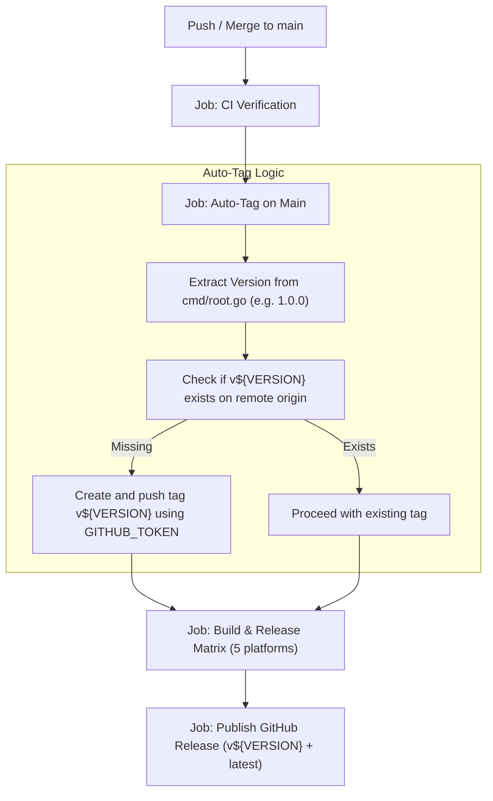

# Technical Design: Automated Git Release Tagging

## 1. Architecture Overview

## 2. Implementation Strategy

### Workflow Configuration (`.github/workflows/release.yml`)
1. **Pre-build Auto-Tag Step / Job**:
   - Executes when `github.ref == 'refs/heads/main'`.
   - Reads `Version` from `cmd/root.go`.
   - Uses `gh api` or `git ls-remote` / `git push` to verify and push `v${VERSION}` if missing.
2. **Release Publishing**:
   - `gh release create "v${VERSION}" release-assets/* --title "Bender v${VERSION}" --generate-notes`
   - Uploads to both `v${VERSION}` tag and updates `latest`.

## 3. Security & Quality Controls
- Uses standard repository `GITHUB_TOKEN` with `contents: write` permissions.
- Idempotent execution: if `v${VERSION}` already exists, no duplicate tags or error aborts occur.
